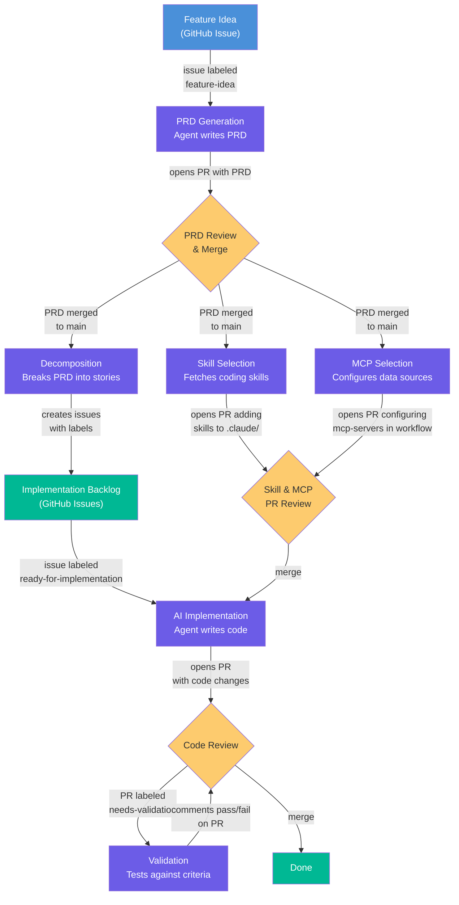
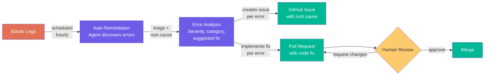

# gh-aw Shared Workflows

Reusable [GitHub Agentic Workflows (gh-aw)](https://github.github.com/gh-aw/) for automating the full software development lifecycle with Claude-powered agents.

Consumer repos pull these workflows in via [remote imports](https://github.github.com/gh-aw/reference/imports/#remote-repository-imports) — no file copying or sync scripts needed.

## Feature Development Pipeline



## Auto-Remediation Pipeline



## Shared Workflows

These workflows are project-agnostic and designed to be imported into any repo:

### Feature Development

| Workflow | Consumer Trigger | Purpose |
|----------|-----------------|---------|
| `shared/prd-generation.md` | Issue labeled `feature-idea` | Generate a PRD from a feature idea |
| `shared/decomposition.md` | PRD merged to `main` | Break PRD into epic + stories |
| `shared/skill-selection.md` | PRD merged to `main` | Fetch coding skills from ai-coding-toolkit |
| `shared/mcp-selection.md` | PRD merged to `main` | Configure MCP servers for implementation agents |
| `shared/validation.md` | PR labeled `needs-validation` | Validate code against PRD acceptance criteria |

### Operations

| Workflow | Consumer Trigger | Purpose |
|----------|-----------------|---------|
| `shared/auto-remediation.md` | Hourly schedule + manual | Discover errors from Elastic, triage, implement fixes, open PRs |

> **Not included:** `implementation.md` is project-specific (references your codebase paths, test commands, and tech stack). Use the template in [agentic-workflow-template](https://github.com/RealPage/agentic-workflow-template) as a starting point.

## Usage

### How imports work

Consumer repos create thin workflow stubs in `.github/workflows/` that declare triggers and permissions, then import shared logic from this repo. The `gh aw compile` command resolves imports, caches them locally, and generates the final workflow files.

See the [gh-aw imports reference](https://github.github.com/gh-aw/reference/imports/#remote-repository-imports) for full details.

### New project

Use [agentic-workflow-template](https://github.com/RealPage/agentic-workflow-template) to scaffold a new repo (workflows are pre-configured with imports):

```bash
gh repo create RealPage/my-project --template RealPage/agentic-workflow-template --private
cd my-project
gh aw compile
```

### Existing project

#### Step 1: Add prerequisites

Make sure these files exist in your repo (skip any you already have):

```bash
# Project context file — describes your tech stack, conventions, and key paths
touch CLAUDE.md

# PRD template — used by the prd-generation workflow
mkdir -p docs/prds/templates
curl -sL "https://raw.githubusercontent.com/RealPage/gh-aw-shared-workflows/v0.1.0/docs/prds/templates/prd-template.md" \
  -o docs/prds/templates/prd-template.md
```

> Your `CLAUDE.md` should describe the project's tech stack, directory structure, coding conventions, and anything an AI agent needs to know to work in the codebase.

#### Step 2: Add workflows

Use `gh aw add` to pull workflows directly from this repo. Each command adds a consumer stub (with triggers and permissions) that imports the shared logic:

```bash
# Add individual workflows
gh aw add RealPage/gh-aw-shared-workflows/prd-generation
gh aw add RealPage/gh-aw-shared-workflows/decomposition
gh aw add RealPage/gh-aw-shared-workflows/skill-selection
gh aw add RealPage/gh-aw-shared-workflows/mcp-selection
gh aw add RealPage/gh-aw-shared-workflows/validation
gh aw add RealPage/gh-aw-shared-workflows/auto-remediation
```

Each stub is a thin wrapper that declares triggers and permissions, then imports the shared logic:

```yaml
---
on:
  workflow_dispatch:
  issues:
    types: [opened, labeled]

permissions:
  contents: read
  issues: read

imports:
  - RealPage/gh-aw-shared-workflows/shared/prd-generation.md@v0.1.0
---
```

> **Pick and choose:** You don't need all 6 workflows. Only add the ones relevant to your project. See the [Shared Workflows](#shared-workflows) table for what each one does.

#### Step 3: Compile and commit

```bash
gh aw compile
git add .github/ docs/
git commit -m "Add agentic development workflows"
git push
```

That's it. Your repo now has agentic workflows powered by shared imports.

### Updating to a new version

When this repo publishes a new release, bump the version ref in your stubs:

```yaml
imports:
  - RealPage/gh-aw-shared-workflows/shared/prd-generation.md@v0.2.0
```

Then recompile:

```bash
gh aw compile
git add .github/
git commit -m "Update shared workflows to v0.2.0"
```

You can also pin to a branch (`@main`) during development or a commit SHA for immutable references.

## Consumer Prerequisites

Workflows assume the following exist in the consumer repo:

| Requirement | Used by | Description |
|-------------|---------|-------------|
| `CLAUDE.md` | All workflows | Project context, tech stack, and conventions |
| `docs/prds/templates/prd-template.md` | `prd-generation` | PRD template structure (see `docs/` in this repo for a reference copy) |
| `.github/workflows/implementation.md` | `mcp-selection` | Project-specific implementation workflow that MCP selection configures |

### Auto-remediation setup

| Type | Name | Description |
|------|------|-------------|
| Variable | `SERVICE_NAME` | Service name to search errors for in Elastic |
| Variable | `ELASTIC_MCP_URL` | Elastic MCP server endpoint URL |
| Secret | `ELASTIC_MCP_API_KEY` | Elastic API key for authentication |

## Versioning

This repo uses semver tags for stable releases:

- **Patch** (`v0.1.1`) — bug fixes to workflow instructions
- **Minor** (`v0.2.0`) — new workflows or non-breaking enhancements
- **Major** (`v1.0.0`) — stable rollout release

Pin to a specific version in production (e.g., `@v0.1.0`). Use `@main` only during development.

## Migration from sync script

If your project previously used `sync-workflows.sh` to copy workflows:

1. For each workflow in `.github/workflows/`, replace the full file content with a thin import stub (see `workflows/`)
2. Delete `scripts/sync-workflows.sh` from your repo
3. Remove any auto-sync GitHub Actions workflow (e.g., weekly sync cron)
4. Run `gh aw compile` and commit the changes

## Contributing

1. Create a branch in this repo
2. Edit the shared workflow under `shared/`
3. Test by pointing a consumer stub at your branch: `@my-branch`
4. Open a PR — once merged and tagged, all consumers can bump their version ref
