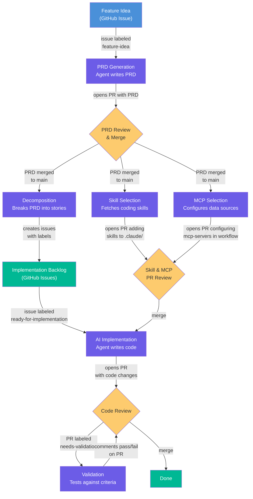
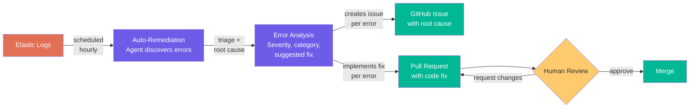

# gh-aw Shared Workflows

Reusable [GitHub Agentic Workflows (gh-aw)](https://github.github.com/gh-aw/) for automating the full software development lifecycle with Claude-powered agents.

## Feature Development Pipeline



## Auto-Remediation Pipeline



## Shared Workflows

These workflows are project-agnostic and can be synced into any repo:

### Feature Development

| Workflow | Trigger | Purpose |
|----------|---------|---------|
| `prd-generation.md` | Issue labeled `feature-idea` | Generate a PRD from a feature idea |
| `decomposition.md` | PRD merged to `main` | Break PRD into epic + stories |
| `skill-selection.md` | PRD merged to `main` | Fetch coding skills from ai-coding-toolkit |
| `mcp-selection.md` | PRD merged to `main` | Configure MCP servers for implementation agents |
| `validation.md` | PR labeled `needs-validation` | Validate code against PRD acceptance criteria |

### Operations

| Workflow | Trigger | Purpose |
|----------|---------|---------|
| `auto-remediation.md` | Hourly schedule + manual | Discover errors from Elastic, triage, implement fixes, open PRs |

> **Not included:** `implementation.md` is project-specific (references your codebase paths, test commands, and tech stack). Use the template in [agentic-workflow-template](https://github.com/RealPage/agentic-workflow-template) as a starting point.

### Auto-Remediation Setup

The auto-remediation workflow requires additional configuration:

| Type | Name | Description |
|------|------|-------------|
| Variable | `SERVICE_NAME` | Service name to search errors for in Elastic |
| Variable | `ELASTIC_MCP_URL` | Elastic MCP server endpoint URL |
| Secret | `ELASTIC_MCP_API_KEY` | Elastic API key for authentication |

## Usage

### New Project

Use [agentic-workflow-template](https://github.com/RealPage/agentic-workflow-template) to scaffold a new repo, then sync:

```bash
gh repo create RealPage/my-project --template RealPage/agentic-workflow-template --private
cd my-project
./scripts/sync-workflows.sh
gh aw compile
```

### Existing Project

```bash
# Download the sync script
mkdir -p scripts
gh api repos/RealPage/gh-aw-shared-workflows/contents/scripts/sync-workflows.sh \
  --jq '.content' | base64 -d > scripts/sync-workflows.sh
chmod +x scripts/sync-workflows.sh

# Pull all shared workflows
./scripts/sync-workflows.sh

# Create your project-specific implementation.md
# (see template repo for example)

# Compile and commit
gh aw compile
git add .github/workflows/ scripts/
git commit -m "Add agentic development workflows"
```

### Staying in Sync

Projects created from the template include a GitHub Actions workflow that auto-syncs weekly and opens a PR if workflows have changed. You can also sync manually:

```bash
./scripts/sync-workflows.sh
gh aw compile
```

## Contributing

1. Create a branch in this repo
2. Edit the workflow under `workflows/`
3. Test your changes by copying the workflow into a project and running `gh aw compile` + `gh aw run <workflow>`
4. Open a PR — once merged, all synced projects will pick up the change on their next sync
