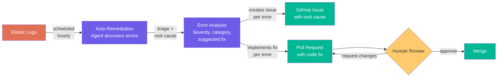

# Auto-Remediation Pipeline

Discovers errors from production logs, triages them with AI, and opens fix PRs for human review.

## How It Works



The workflow runs on a schedule (hourly) or manually and progresses through five stages:

1. **Error Discovery** — Queries Elastic APM logs for ERROR-level entries, groups by error type, deduplicates, and ranks by occurrence count
2. **Triage & Root Cause Analysis** — Classifies each error by category (network, database, validation, etc.) and severity (critical/high/medium/low), identifies the exact code location and root cause
3. **Issue Creation** — Creates GitHub issues with root cause analysis, suggested fixes, and stack traces. Skips duplicates if an open issue already exists for the same error
4. **Implementation** — For high/medium confidence fixes, implements minimal code changes and opens PRs. Low confidence or security-sensitive errors are flagged for human investigation only
5. **Summary** — Reports total errors discovered, issues created, PRs opened, and duplicates skipped

## Setup

Add the workflow to your repo:

```bash
gh aw add RealPage/agentics/auto-remediation
gh aw compile
```

Then configure these in your repo's GitHub settings:

| Type | Name | Description |
|------|------|-------------|
| Variable | `SERVICE_NAME` | Service name to search errors for in Elastic |
| Variable | `ELASTIC_MCP_URL` | Elastic MCP server endpoint URL |
| Secret | `ELASTIC_MCP_API_KEY` | Elastic API key for authentication |

## Safety Guardrails

- **Confidence gating** — Only implements fixes where root cause confidence is high or medium
- **Security-sensitive code** — Authentication, authorization, and cryptography areas are flagged for human implementation only
- **Protected paths** — CI/CD configs, deployment manifests, and infrastructure files are never modified automatically
- **Test preservation** — Existing tests are never deleted or weakened, only added or strengthened
- **Minimal fixes** — Each PR fixes exactly one error with the smallest change needed

## Swapping Data Sources

The workflow uses Elastic via MCP, but the data source is pluggable. To use a different error tracking system (e.g., Sentry, Datadog), replace the `mcp-servers` block in the workflow's frontmatter and adjust the query instructions.

See the [full workflow definition](../workflows/auto-remediation.md) for complete agent instructions.
