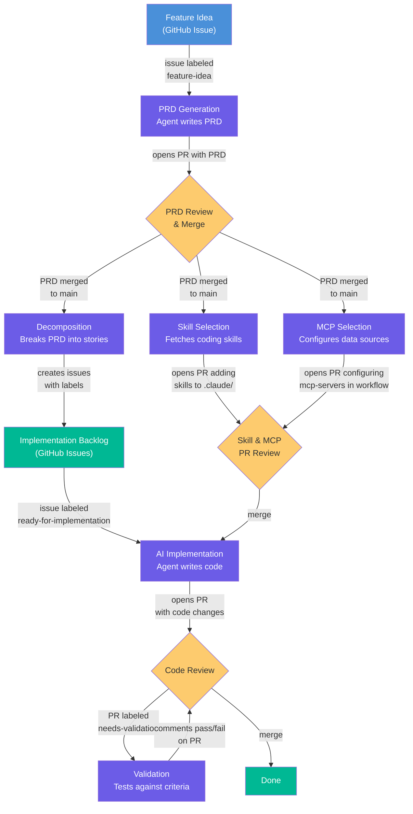
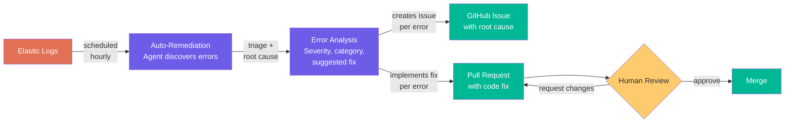

# Workflow Reference

Detailed documentation for all agentic workflows in this repo.

## Available Workflows

| Workflow | Trigger | What It Does |
|----------|---------|-------------|
| [prd-generation](../workflows/prd-generation.md) | Issue labeled `feature-idea` | Generates a PRD from a feature idea, opens a PR |
| [decomposition](../workflows/decomposition.md) | PRD merged to main | Breaks PRD into epic + story issues with priority labels |
| [skill-selection](../workflows/skill-selection.md) | PRD merged to main | Fetches coding skills from `RealPage/ai-coding-toolkit` |
| [mcp-selection](../workflows/mcp-selection.md) | PRD merged to main | Configures MCP servers in the implementation workflow |
| [validation](../workflows/validation.md) | PR labeled `needs-validation` | Validates implementation against PRD acceptance criteria |
| [auto-remediation](../workflows/auto-remediation.md) | Hourly schedule / manual | Queries Elastic for errors, triages, creates issues, opens fix PRs |

> **Not included:** `implementation.md` is project-specific (references your codebase paths, test commands, and tech stack). Use the template in [agentic-workflow-template](https://github.com/RealPage/agentic-workflow-template) as a starting point.

## Feature Development Pipeline

These workflows chain together to automate the full feature lifecycle: idea → PRD → stories → implementation → validation.



## Auto-Remediation Pipeline

Discovers errors from production logs, triages them with AI, and opens fix PRs for human review.



### Auto-remediation setup

The auto-remediation workflow requires these to be configured in your repo:

| Type | Name | Description |
|------|------|-------------|
| Variable | `SERVICE_NAME` | Service name to search errors for in Elastic |
| Variable | `ELASTIC_MCP_URL` | Elastic MCP server endpoint URL |
| Secret | `ELASTIC_MCP_API_KEY` | Elastic API key for authentication |

## How Workflows Work

Each workflow is a markdown file with YAML frontmatter that declares the AI engine, safety constraints, and optional MCP server connections. The body contains natural language instructions that the agent follows.

```yaml
---
engine: claude

safe-outputs:
  create-pull-request:
    max: 1
  add-comment:
    max: 3

mcp-servers:         # Optional — external tool access
  elastic:
    url: ${{ vars.ELASTIC_MCP_URL }}
---

# Workflow Title

Instructions the agent follows...
```

Your repo creates thin stubs in `.github/workflows/` that declare triggers and import the shared logic:

```yaml
---
on:
  issues:
    types: [opened, labeled]

imports:
  - RealPage/agentics/workflows/prd-generation.md@v0.1.0
---
```

Running `gh aw compile` resolves imports and generates the GitHub Actions YAML. See the [gh-aw imports reference](https://github.github.com/gh-aw/reference/imports/#remote-repository-imports) for full details.
