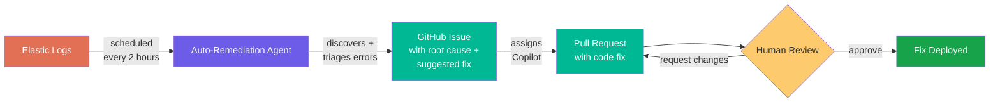

# Auto-Remediation

A single agent that discovers errors from production logs, triages them, and creates GitHub issues for human review.

## Pipeline



## How It Works

The auto-remediation agent runs on a schedule (every 2 hours) or manually via `workflow_dispatch`. A single agent handles the entire pipeline:

1. **Prerequisite Check** — Verifies that Elastic Agent Builder is enabled in the target Kibana space. If not, creates a setup issue with enablement instructions and stops.

2. **Error Discovery** — Queries Elastic APM logs for ERROR-level entries using ES|QL, extracts event and logger fields from JSON messages, groups by error type, filters out test/CI noise, deduplicates, and ranks by occurrence count. Keeps at most 5 unique errors.

3. **Triage & Root Cause Analysis** — For each error, classifies by:
   - **Severity**: critical / high / medium / low
   - **Category**: syntax, runtime, type, network, database, authentication, authorization, validation, configuration, dependency, memory, timeout, or unknown
   - **Root cause**: code location, fix description, complexity, and confidence level

4. **Issue Creation** — Creates GitHub issues with root cause analysis, Kibana deep links, and suggested fixes. Skips duplicates if an open issue with the `auto-remediation` label already exists for the same error. Labels each issue with severity, category, and `auto-remediation`.

5. **Copilot Assignment** — Assigns Copilot to each newly created issue to generate a fix PR automatically.

6. **Human Review** — A human reviews the Copilot-generated PR, approves or requests changes.

7. **Fix Deployed** — Once approved and merged, the fix is deployed through the repo's normal CI/CD pipeline.

## Workflows Used

| Workflow | Role |
|----------|------|
| [auto-remediation](../../workflows/auto-remediation.md) | Error discovery, triage, issue creation, and Copilot assignment |

## Setup

```bash
# Add the workflow (wizard walks through configuration)
gh aw add-wizard RealPage/agentic-workflows/workflows/auto-remediation.md@v0.2.0
```

The wizard prompts for the required inputs. For scheduled runs, edit your local `.github/workflows/auto-remediation.md` to add `default:` values since there's no one to provide inputs interactively.

### Required Configuration

| Type | Name | Description |
|------|------|-------------|
| Input | `service_name` | APM service name in the log index |
| Input | `kibana_base_url` | Kibana base URL including space prefix |
| Input | `kibana_data_view_id` | Kibana data view ID for APM logs |
| Variable | `ELASTIC_ESQL_URL` | Elastic ES\|QL endpoint URL |
| Secret | `ELASTIC_MCP_API_KEY` | Elastic API key for authentication |

### Optional Inputs

| Input | Default | Description |
|-------|---------|-------------|
| `lookback_hours` | `2` | How far back to search for errors |
| `error_limit` | `20` | Max error groups to return from query |
| `title_prefix` | *(empty)* | Optional prefix for issue titles (e.g., `KNCK-00000 `) |

## Safety Guardrails

- **Duplicate detection** — Checks for existing open issues before creating new ones
- **Noise filtering** — Skips errors from pytest, unittest, and local dev paths
- **Capped outputs** — Max 6 issues and 5 Copilot assignments per run
- **Human review** — All Copilot-generated fix PRs require human approval before merge
- **Labeled issues** — Every issue gets `auto-remediation` + `bug` labels plus severity and category for easy triage

## Swapping Data Sources

The workflow uses Elastic via ES|QL queries, but the data source is pluggable. To use a different error tracking system (e.g., Sentry, Datadog), replace the `safe-inputs` block in the workflow frontmatter and adjust the query instructions.
