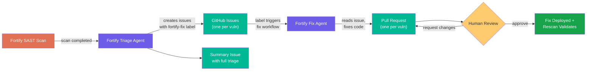

# Fortify Remediation

A two-workflow pipeline that pulls Fortify on Demand SAST scan results, triages vulnerabilities into GitHub issues, and automatically remediates critical and high findings with targeted code fixes.

## Pipeline



## How It Works

The pipeline uses two separate workflows that communicate through GitHub issues. This separation provides clear boundaries between read-only triage and code-modifying remediation, with human control over which findings get auto-fixed.

### Workflow 1: Fortify Triage

Runs after a Fortify scan completes (or on a weekly schedule / manual dispatch). A pre-step authenticates to the Fortify on Demand API outside the agent sandbox and fetches all vulnerability data into local JSON files. The agent then:

1. **Reads Fortify Data** — Parses the pre-fetched release summary, vulnerability list, and per-finding details from local JSON files. The agent never calls the Fortify API directly.

2. **Filters Findings** — Skips suppressed vulnerabilities and already-removed findings. Groups remaining by severity.

3. **Creates Individual Issues** — For each critical and high vulnerability, creates a GitHub issue containing the full Fortify finding: severity, CWE reference, affected file and line, explanation of the vulnerability, and Fortify's recommended remediation. Labels each issue with `fortify`, `security`, severity level, and `fortify-fix`.

4. **Creates Summary Issue** — Creates a single triage summary issue with severity counts, links to all individual issues, and a log of medium/low findings that were not triaged.

### Workflow 2: Fortify Fix

Triggers when an issue receives the `fortify-fix` label (applied automatically by the triage workflow, or manually by a developer). For each triggered issue:

1. **Reads the Issue** — Extracts vulnerability details, affected file path, line number, CWE, and Fortify's recommended fix from the issue body.

2. **Reads Vulnerable Code** — Opens the affected source file and understands the context around the flagged line.

3. **Fixes the Code** — Creates a dedicated branch (`fortify-fix/<vulnId>`), applies a minimal targeted fix following Fortify's remediation guidance, and verifies only the intended changes were made.

4. **Opens a Pull Request** — Creates a PR linked to the issue with a clear description of what was vulnerable and what was changed. The commit message includes `Closes #<issue>` so merging auto-closes the issue.

5. **Comments on the Issue** — Adds a comment linking to the PR for tracking.

## Workflows Used

| Workflow | Role | Trigger |
|----------|------|---------|
| [fortify-triage](../../workflows/fortify-triage.md) | Fetch Fortify data, create one issue per critical/high finding, create summary | Fortify scan completion, weekly schedule, manual |
| [fortify-fix](../../workflows/fortify-fix.md) | Read issue, fix vulnerable code, open PR | Issue labeled `fortify-fix`, manual |

## Setup

### 1. Add the workflows to your repository

Copy both workflow files into your repo's `.github/workflows/` directory:

```bash
# From the agentic-workflows repo
cp workflows/fortify-triage.md <your-repo>/.github/workflows/
cp workflows/fortify-fix.md <your-repo>/.github/workflows/

# Compile both
cd <your-repo>
gh aw compile fortify-triage
gh aw compile fortify-fix
```

### 2. Configure the Fortify release ID

Set the Fortify release ID as a repository secret (gh-aw does not allow `vars.*` in expressions, so we use a secret even though the release ID is not sensitive):

```bash
gh secret set FOD_RELEASE_ID --body "<YOUR_RELEASE_ID>"
```

Alternatively, pass `fod_release_id` as a `workflow_dispatch` input for ad-hoc runs. The workflow_dispatch input takes precedence over the secret.

### 3. Add repository secrets

| Secret | Description |
|--------|-------------|
| `FOD_USERNAME` | Fortify on Demand username (e.g., `Real_Page\your.user`) |
| `FOD_PAT` | Fortify on Demand personal access token |
| `FOD_RELEASE_ID` | Fortify on Demand release ID (see above) |
| `ANTHROPIC_API_KEY` | API key for the Claude engine |

```bash
gh secret set FOD_USERNAME
gh secret set FOD_PAT
gh secret set FOD_RELEASE_ID
gh secret set ANTHROPIC_API_KEY
```

### 5. Create labels

Create these labels in your repository (the triage workflow uses them):

```bash
gh label create fortify --description "Fortify SAST finding" --color "d93f0b"
gh label create fortify-fix --description "Triggers Fortify fix workflow" --color "e11d48"
gh label create security --description "Security vulnerability" --color "b60205"
gh label create critical --description "Critical severity" --color "7d0000"
gh label create high --description "High severity" --color "d93f0b"
gh label create triage-summary --description "Fortify triage summary" --color "0075ca"
```

## Safety Guardrails

- **Two-workflow separation** — Triage is read-only (no code changes). Remediation only triggers when an issue is explicitly labeled, giving humans a control point.
- **One PR per vulnerability** — Each fix is isolated in its own branch and PR, making review, approval, and rollback granular.
- **Duplicate detection** — Triage checks for existing issues before creating new ones. Fix checks for existing PRs before opening duplicates.
- **Suppressed findings skipped** — Vulnerabilities marked as suppressed in Fortify are excluded from triage entirely.
- **Minimal changes** — The fix agent only modifies code needed to resolve the specific vulnerability. No refactoring, no surrounding cleanup.
- **Human review required** — All fix PRs require human approval before merge.
- **Graceful noop** — Both workflows exit cleanly when there's nothing to do (no findings, no labeled issues, already fixed).

## Planned Enhancements

### Replace PAT authentication with OAuth client credentials

The current pre-step uses a personal access token (`FOD_PAT`) with password grant authentication. This should be replaced with OAuth client credentials flow using `FOD_CLIENT_ID` and `FOD_CLIENT_SECRET`, which:
- Avoids tying API access to a specific user account
- Aligns with the existing Fortify AST scan workflow's auth pattern
- Supports proper service account rotation and auditing

### Add application name input to resolve release ID dynamically

The Fortify release ID is currently supplied via the `FOD_RELEASE_ID` repo variable or a `workflow_dispatch` input. A better long-term approach would be to accept a `fortify_app_name` input and resolve the release ID dynamically via the Fortify API:

1. Query `GET /api/v3/applications?filters=applicationName:<name>` to get the application ID
2. Query `GET /api/v3/applications/<appId>/releases?filters=sdlcStatusType:Production` to get the active release ID
3. Use the resolved release ID for all subsequent API calls

This makes the workflow reusable across repositories without editing the pre-step each time.

### Support for medium severity findings

Currently only critical and high findings are triaged into individual issues. Medium findings could optionally be included via a severity threshold input (e.g., `min_severity: medium`).
