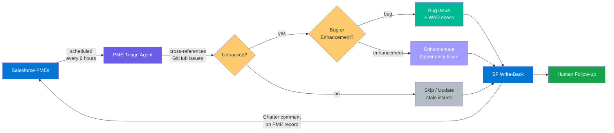

# PME Triage

Fetches Problem Management Escalations from Salesforce, cross-references them against GitHub Issues, surfaces untracked PMEs as new issues, and writes triage results back to Salesforce. Detects enhancement clusters and works-as-designed customer pain.

## Pipeline



## How It Works

The PME triage agent runs on a schedule (every 6 hours) or manually via `workflow_dispatch`. A single agent handles the entire pipeline:

1. **Connectivity Check** — Verifies Salesforce OAuth authentication and access to the `Problem_Management_Escalation__c` object. If authentication fails, creates a setup issue with troubleshooting steps and stops.

2. **Fetch Open PMEs** — Queries Salesforce via SOQL for open PMEs within the lookback window, optionally filtered by product. Returns PME details including priority, status, teams, and linked work items.

3. **Cross-Reference & SF Write-Back** — Searches this repository's GitHub Issues for existing tracking issues (identified by the `pme-triage` label and PME name). Builds lists of already-tracked, untracked, and stale PMEs. For already-tracked PMEs, posts the GitHub issue link back to the Salesforce PME record as a Chatter comment (deduped via issue body marker).

4. **Classify & Rank** — Groups related untracked PMEs, classifies each group as a **bug** or **enhancement** (P4 feature requests), scores by priority/age/cluster size, and detects **works-as-designed** behavior causing customer pain.

5. **Create Issues** — Creates GitHub issues for untracked PMEs (up to 5 per run). Bug groups get structured details with priority labels. Enhancement groups get a "Product Opportunity" template with demand signals and `enhancement-backlog` label. WAD-flagged groups get an additional "Product Opportunity — Works As Designed" section and `wad:customer-impact` label.

6. **SF Write-Back** — Posts GitHub issue links back to each PME record in Salesforce via a batched custom safe output job (`sf-comment`). Comments are permanent (FeedItem deletion is disabled org-wide).

7. **Update Stale Issues** — Comments on existing tracking issues where the Salesforce PME has been modified since the issue was created, with a corresponding SF write-back.

8. **Human Follow-up** — Teams review the created issues, assign ownership, and link to implementation work. Product teams review `enhancement-backlog` and `wad:customer-impact` issues separately.

## Workflows Used

| Workflow | Role |
|----------|------|
| [pme-triage](../../workflows/pme-triage.md) | Salesforce fetch, cross-reference, issue creation |

## Setup

```bash
# Add the workflow (wizard walks through configuration)
gh aw add-wizard RealPage/agentics/workflows/pme-triage.md@v0.3.0
```

The wizard prompts for optional inputs. For scheduled runs, edit your local `.github/workflows/pme-triage.md` to add `default:` values for your product filter since there's no one to provide inputs interactively.

### Required Configuration

| Type | Name | Description |
|------|------|-------------|
| Variable | `SF_OAUTH_CLIENT_ID` | Salesforce Connected App client ID for `pmeautomation@realpage.com` |
| Secret | `SF_OAUTH_SECRET` | Salesforce Connected App client secret |

### Optional Inputs

| Input | Default | Description |
|-------|---------|-------------|
| `product_filter` | *(empty — all products)* | SOQL LIKE pattern for `Support_Product_Name__c` (e.g., `%Knock%`) |
| `priority_filter` | *(empty — all priorities)* | SOQL LIKE pattern for `Priority__c` (e.g., `P4%`) |
| `pme_limit` | `25` | Max PMEs to fetch from Salesforce per run |
| `lookback_days` | `30` | How far back to search for open PMEs |
| `title_prefix` | `PME ` | Prefix for created issue titles |

## Safety Guardrails

- **Duplicate detection** — Checks for existing open issues with the `pme-triage` label before creating new ones
- **Capped outputs** — Max 5 issues and 5 comments per run
- **SF write-back gating** — Salesforce writes go through a custom safe output job (`sf-comment`), not MCP scripts. Comments are batched into a single call and the job only runs if the agent emits items. FeedItem deletion is disabled org-wide — all comments are permanent.
- **SF write-back dedup** — The agent checks the GitHub issue body for an `SF write-back: done` marker before posting to avoid duplicate Chatter comments on repeated runs
- **Stale update, not duplicate** — If a PME already has a tracking issue but has been updated in Salesforce, the agent comments on the existing issue rather than creating a duplicate
- **Auth failure isolation** — If Salesforce credentials are missing or invalid, the agent creates a single setup issue and stops rather than failing silently
- **Conservative classification** — When in doubt, PMEs are classified as bugs (not enhancements) and not flagged as WAD. Over-surfacing is preferred to under-surfacing.
- **Labeled issues** — Labels are applied only if they already exist in the repository. If a label is missing, the priority is appended to the issue title as a suffix instead (e.g., `[priority:high]`).

## Labels

The workflow uses the following labels if they exist in the consumer repository. Create them before the first run for the best experience:

- `pme-triage` — applied to all issues created by this workflow
- `priority:critical` — PMEs with `P1` priority
- `priority:high` — PMEs with `P2` priority
- `priority:medium` — PMEs with `P3` priority (or null/unrecognized)
- `priority:low` — PMEs with `P4` priority
- `enhancement-backlog` — P4 enhancement/feature-request PME clusters for product review
- `wad:customer-impact` — PMEs describing works-as-designed behavior causing customer pain

## Troubleshooting

### Agent timeouts

The agent step has a 10-minute timeout. Runs that create many issues can exceed this because each issue body requires significant LLM output tokens. The pipeline itself (SF fetch, cross-reference, grouping) is fast — typically under 1 minute. Issue creation dominates the time budget.

**Symptoms:** The workflow completes with `conclusion: failure`, but `safe_outputs` succeeds — meaning the agent produced output before the timeout killed it. Created issues may be missing labels or SF write-back comments.

**Mitigations:**
- Keep `create-issue: max` at 5 or lower. The 6-hour schedule means 4 runs/day × 5 issues = 20 issues/day.
- Use `priority_filter` and `product_filter` to narrow the PME scope for manual dispatches.
- Lower `pme_limit` if cross-referencing many PMEs is slow (each PME requires a GitHub search).

**Diagnosing a timeout:**

1. Run `gh aw audit <run-id>` for a high-level breakdown of turns, tool calls, and token usage.
2. Parse the agent conversation from the audit logs to identify where time was spent:
   ```bash
   # List downloaded audit logs
   ls .github/aw/logs/

   # Parse the agent conversation timeline
   python3 -c "
   import json
   with open('.github/aw/logs/run-<id>/agent-stdio.log') as f:
       for line in f:
           try:
               e = json.loads(line.strip())
               ts = e.get('timestamp','')[:19]
               if e['type'] == 'assistant':
                   for c in e['message']['content']:
                       if c['type'] == 'tool_use':
                           print(f'{ts}  CALL  {c[\"name\"]}')
               elif e['type'] == 'user' and ts:
                   print(f'{ts}  RESULT')
           except: pass
   "
   ```
3. Look for long gaps between a `CALL` and its `RESULT` — that's either a slow MCP tool or slow LLM output generation. A cluster of `create_issue` calls followed by `search_issues` or `list_issues` calls indicates the agent is searching for its own newly created issues (a known anti-pattern addressed by the "safe output timing" prompt note).

## Future: TFS Cross-Referencing

The workflow currently cross-references against GitHub Issues only. A future version will add support for checking TFS work items via `Azure_DevOps_ID__c` fields on the PME object, using the TFS REST API. This requires self-hosted runners with network access to `tfs.realpage.com`.
