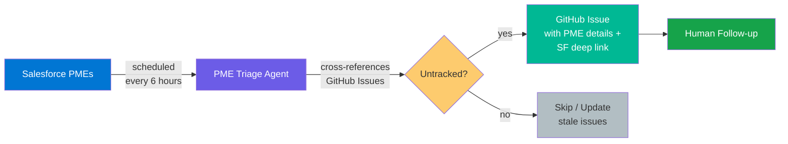

# PME Triage

Fetches Problem Management Escalations from Salesforce, cross-references them against GitHub Issues, and surfaces untracked PMEs as new issues.

## Pipeline



## How It Works

The PME triage agent runs on a schedule (every 6 hours) or manually via `workflow_dispatch`. A single agent handles the entire pipeline:

1. **Connectivity Check** — Verifies Salesforce OAuth authentication and access to the `Problem_Management_Escalation__c` object. If authentication fails, creates a setup issue with troubleshooting steps and stops.

2. **Fetch Open PMEs** — Queries Salesforce via SOQL for open PMEs within the lookback window, optionally filtered by product. Returns PME details including priority, status, teams, and linked work items.

3. **Cross-Reference** — Searches this repository's GitHub Issues for existing tracking issues (identified by the `pme-triage` label and PME name). Builds lists of already-tracked, untracked, and stale PMEs.

4. **Rank** — Scores untracked PMEs by priority weight × age factor. Critical + old PMEs surface first.

5. **Create Issues** — Creates GitHub issues for untracked PMEs (up to 10 per run) with structured details, Salesforce deep links, and priority labels.

6. **Update Stale Issues** — Comments on existing tracking issues where the Salesforce PME has been modified since the issue was created.

7. **Human Follow-up** — Teams review the created issues, assign ownership, and link to implementation work.

## Workflows Used

| Workflow | Role |
|----------|------|
| [pme-triage](../../workflows/pme-triage.md) | Salesforce fetch, cross-reference, issue creation |

## Setup

```bash
# Add the workflow (wizard walks through configuration)
gh aw add-wizard RealPage/agentics/workflows/pme-triage.md@v0.3.0
```

The wizard prompts for optional inputs. For scheduled runs, edit your local `.github/workflows/pme-triage.md` to add `default:` values for your product filter since there's no one to provide inputs interactively.

### Required Configuration

| Type | Name | Description |
|------|------|-------------|
| Secret | `SF_OAUTH_CLIENT_ID` | Salesforce Connected App client ID for `pmeautomation@realpage.com` |
| Secret | `SF_OAUTH_SECRET` | Salesforce Connected App client secret |

### Optional Inputs

| Input | Default | Description |
|-------|---------|-------------|
| `product_filter` | *(empty — all products)* | SOQL LIKE pattern for `Support_Product_Name__c` (e.g., `%Knock%`) |
| `pme_limit` | `25` | Max PMEs to fetch from Salesforce per run |
| `lookback_days` | `30` | How far back to search for open PMEs |
| `title_prefix` | `PME ` | Prefix for created issue titles |

## Safety Guardrails

- **Duplicate detection** — Checks for existing open issues with the `pme-triage` label before creating new ones
- **Capped outputs** — Max 10 issues and 5 comments per run
- **Stale update, not duplicate** — If a PME already has a tracking issue but has been updated in Salesforce, the agent comments on the existing issue rather than creating a duplicate
- **Auth failure isolation** — If Salesforce credentials are missing or invalid, the agent creates a single setup issue and stops rather than failing silently
- **Labeled issues** — Every issue gets `pme-triage` + `priority:{level}` labels for easy filtering

## Future: TFS Cross-Referencing

The workflow currently cross-references against GitHub Issues only. A future version (v2) will add support for checking TFS work items via `Azure_DevOps_ID__c` fields on the PME object, using the TFS REST API. This requires self-hosted runners with network access to `tfs.realpage.com`.
