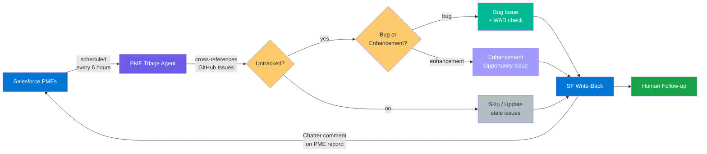

# PME Triage

Fetches Problem Management Escalations from Salesforce, cross-references them against GitHub Issues, surfaces untracked PMEs as new issues, and writes triage results back to Salesforce. Detects enhancement clusters and works-as-designed customer pain.

## Pipeline



## How It Works

The workflow uses a **deterministic pre-step + agentic classification** architecture. The pre-step handles all external data fetching; the agent focuses on grouping, scoring, and issue creation.

### Pre-Step (deterministic)

Runs in the **pre-activation job** (`on.steps:`), a separate GitHub Actions job that executes before the agent. This job has access to secrets (for Salesforce OAuth) but is isolated from the agent sandbox.

1. **Salesforce Auth & Fetch** — Authenticates via OAuth client_credentials and queries Salesforce for open PMEs within the lookback window, filtered by product and/or priority. If authentication fails, writes an error to the context file for the agent to handle.

2. **GitHub Issue Listing** — Lists all open issues with the `pme-triage` label in a single `gh issue list` call.

3. **Label Check** — Checks which labels exist in the repository so the agent doesn't waste turns on label lookups.

4. **State File Load** — Reads `pme-state.json` from the `memory/pme-triage` branch via `git show`.

5. **Context Assembly** — Writes all data to `/tmp/gh-aw/agent/pme-context.json`.

6. **Artifact Upload** — Uploads the context file as a GitHub Actions artifact. Since the pre-step and agent run in separate jobs (separate runners), files don't persist across them. The agent job downloads this artifact before the agent starts, placing the context file where the agent expects it. The artifact is ephemeral (1-day retention) — it only needs to survive long enough for the agent job to download it within the same workflow run. Cross-run state is handled separately by [repo memory](#repo-memory), which is persistent.

### Agent (agentic)

Reads the pre-computed context file and handles the judgment-heavy work:

1. **Cross-Reference** — Matches PMEs against the state file and GitHub issues. Builds lists of already-tracked, untracked, and stale PMEs. Backfills `issue_pending` entries from prior runs.

2. **Classify & Rank** — Groups related untracked PMEs, classifies as **bug** or **enhancement**, scores by priority/age/cluster size, and detects **works-as-designed** behavior.

3. **Create Issues** — Creates GitHub issues (up to 5/run) with structured templates. Applies labels where they exist.

4. **SF Write-Back** — Collects Chatter comments for all PMEs (tracked, new, stale) and calls the `sf-comment` safe output job once with the full batch.

5. **State Update** — Writes updated `pme-state.json` to repo memory.

### Human Follow-up

Teams review the created issues, assign ownership, and link to implementation work. Product teams review `enhancement-backlog` and `wad:customer-impact` issues separately.

## Workflows Used

| Workflow | Role |
|----------|------|
| [pme-triage](../../workflows/pme-triage.md) | Salesforce fetch, cross-reference, issue creation |

## Setup

```bash
# Add the workflow (wizard walks through configuration)
gh aw add-wizard RealPage/agentic-workflows/workflows/pme-triage.md@v0.3.0
```

The wizard prompts for optional inputs. For scheduled runs, edit your local `.github/workflows/pme-triage.md` to add `default:` values for your product filter since there's no one to provide inputs interactively.

### Required Configuration

| Type | Name | Description |
|------|------|-------------|
| Variable | `SF_OAUTH_CLIENT_ID` | Salesforce Connected App client ID for `pmeautomation@realpage.com` |
| Secret | `SF_OAUTH_SECRET` | Salesforce Connected App client secret |

### Optional Inputs

| Input | Default | Description |
|-------|---------|-------------|
| `product_filter` | *(empty — all products)* | SOQL LIKE pattern for `Support_Product_Name__c` (e.g., `%Knock%`) |
| `priority_filter` | *(empty — all priorities)* | SOQL LIKE pattern for `Priority__c` (e.g., `P4%`) |
| `pme_limit` | `25` | Max PMEs to fetch from Salesforce per run |
| `lookback_days` | `30` | How far back to search for open PMEs |
| `title_prefix` | `PME ` | Prefix for created issue titles |

## Safety Guardrails

- **Repo memory state** — Maintains `pme-state.json` on the `memory/pme-triage` branch. Known PMEs skip GitHub search on subsequent runs. New issues are recorded as `issue_pending` and backfilled with real issue numbers on the next run.
- **Duplicate detection** — Checks for existing open issues with the `pme-triage` label before creating new ones
- **Capped outputs** — Max 5 issues and 5 comments per run
- **SF write-back gating** — Salesforce writes go through a custom safe output job (`sf-comment`), not MCP scripts. Comments are batched into a single call and the job only runs if the agent emits items. FeedItem deletion is disabled org-wide — all comments are permanent.
- **SF write-back dedup** — The agent checks the GitHub issue body for an `SF write-back: done` marker before posting to avoid duplicate Chatter comments on repeated runs
- **Stale update, not duplicate** — If a PME already has a tracking issue but has been updated in Salesforce, the agent comments on the existing issue rather than creating a duplicate
- **Auth failure isolation** — If Salesforce credentials are missing or invalid, the agent creates a single setup issue and stops rather than failing silently
- **Conservative classification** — When in doubt, PMEs are classified as bugs (not enhancements) and not flagged as WAD. Over-surfacing is preferred to under-surfacing.
- **Labeled issues** — Labels are applied only if they already exist in the repository. If a label is missing, the priority is appended to the issue title as a suffix instead (e.g., `[priority:high]`).

## Labels

The workflow uses the following labels if they exist in the consumer repository. Create them before the first run for the best experience:

- `pme-triage` — applied to all issues created by this workflow
- `priority:critical` — PMEs with `P1` priority
- `priority:high` — PMEs with `P2` priority
- `priority:medium` — PMEs with `P3` priority (or null/unrecognized)
- `priority:low` — PMEs with `P4` priority
- `enhancement-backlog` — P4 enhancement/feature-request PME clusters for product review
- `wad:customer-impact` — PMEs describing works-as-designed behavior causing customer pain

## Troubleshooting

### Agent timeouts

The agent step has a 10-minute timeout. With the deterministic pre-step handling all data fetching, the agent typically completes in under 3 minutes. Issue creation dominates the time budget when there are many untracked PMEs.

**Mitigations:**
- Keep `create-issue: max` at 5 or lower. The 6-hour schedule means 4 runs/day × 5 issues = 20 issues/day.
- Use `priority_filter` and `product_filter` to narrow the PME scope for manual dispatches.

**Diagnosing issues:**

Run `gh aw audit <run-id>` for a breakdown of turns, tool calls, and token usage. The `agentic_fraction` metric shows how much of the run is actual classification vs. data shuffling — it should be high (>0.5) with the pre-step architecture.

## Repo Memory

The workflow uses gh-aw [repo memory](https://github.github.com/gh-aw/reference/repo-memory/) to maintain cross-reference state across runs. A `pme-state.json` file on the `memory/pme-triage` branch maps each PME to its tracking status:

```json
{
  "PME-493502": {"status": "tracked", "issue": 135, "sf_writeback": true},
  "PME-497398": {"status": "issue_pending", "title": "[Enhancement] AIM: ..."},
  "PME-500128": {"status": "tracked", "issue": 102, "sf_writeback": false}
}
```

**How it works:**
- The deterministic pre-step reads the state file via `git show` from the `memory/pme-triage` branch and includes it in the context file. The agent sees all prior state without making any API calls.
- The agent diffs state against the fresh Salesforce fetch. PMEs already tracked skip GitHub search entirely.
- New issues are recorded as `issue_pending`. On the next run, the agent finds the created issue in the pre-loaded GitHub issues list, backfills the real issue number, and posts the SF write-back.
- The state file is committed and pushed via the `push_repo_memory` safe output at the end of each run.

**Benefits:**
- Faster cross-referencing — state and GitHub issues are pre-loaded, no per-PME API searches
- Real issue links in SF write-back — backfilled on run N+1 instead of referencing by title only
- Audit trail — Git history on the memory branch tracks state changes across runs

## Future: Orchestrator/Worker Split

If the single-workflow approach hits scaling limits, the pipeline can be split into two stages using the gh-aw `dispatch-workflow` orchestration pattern. Repo memory serves as the data-passing mechanism between stages — the orchestrator writes untracked PME data, the worker reads it.

1. **Orchestrator** — Fetches PMEs, cross-references against the state file, writes the untracked PME list to repo memory, dispatches the worker.
2. **Worker** — Reads the untracked PME list from repo memory, groups/scores, creates issues, updates the state file with pending issue records.

Each stage gets its own 10-minute timeout. Repo memory handles branch management, commits, and conflict resolution automatically — no manual cleanup needed.

## Future: TFS Cross-Referencing

The workflow currently cross-references against GitHub Issues only. A future version will add support for checking TFS work items via `Azure_DevOps_ID__c` fields on the PME object, using the TFS REST API. This requires self-hosted runners with network access to `tfs.realpage.com`.
