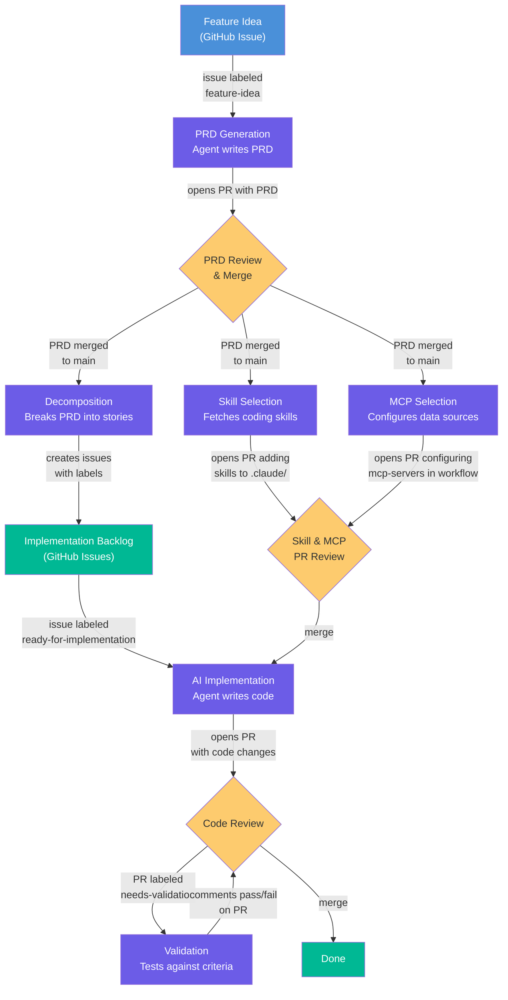

# PRD-Driven Delivery

Automates the full feature lifecycle — from idea to validated PR — by chaining multiple workflows together through GitHub events.

## Pipeline



## Workflows in the Pipeline

Each stage is a separate workflow. They chain through GitHub events — one workflow's output (a merged PR, a labeled issue) triggers the next.

### 1. PRD Generation

**Trigger:** Issue labeled `feature-idea`

Reads the issue description and generates a Product Requirements Document using the template at `docs/prds/templates/prd-template.md`. Opens a PR with the draft PRD for human review.

```bash
gh aw add-wizard RealPage/agentics/workflows/prd-generation.md@v0.2.0
```

### 2. Decomposition

**Trigger:** PRD merged to main

Breaks the PRD into an epic and individual stories as GitHub Issues. Stories are prioritized (P0/P1/P2) based on the PRD's classification and labeled for implementation. P0 stories with no dependencies get labeled `ready-for-implementation` automatically.

```bash
gh aw add-wizard RealPage/agentics/workflows/prd-decomposition.md@v0.2.0
```

### 3. Skill Selection

**Trigger:** PRD merged to main (runs in parallel with decomposition)

Analyzes the PRD's technical requirements and pulls relevant coding skills from [RealPage/ai-coding-toolkit](https://github.com/RealPage/ai-coding-toolkit) into your repo's `.claude/skills/` directory. These skills give implementation agents best practices for your stack.

```bash
gh aw add-wizard RealPage/agentics/workflows/skill-selection.md@v0.2.0
```

### 4. MCP Selection

**Trigger:** PRD merged to main (runs in parallel with decomposition)

Configures MCP servers (BigQuery, Brave Search, Datadog, etc.) in your implementation workflow so agents have access to the right data sources and tools during development.

```bash
gh aw add-wizard RealPage/agentics/workflows/mcp-selection.md@v0.2.0
```

### 5. Implementation

**Trigger:** Issue labeled `agent:implement`

Use [`implement-issue`](../../workflows/implement-issue.md) as the default implementation agent — it discovers your repo's stack, test commands, and conventions at runtime so it works out of the box. Customize it for your repo once you want faster, more predictable runs (see [`docs/workflows/implement-issue.md`](implement-issue.md) for upgrade prompts).

### 6. Validation

**Trigger:** PR labeled `needs-validation`

Validates the implementation against the PRD's acceptance criteria. Posts a checklist on the PR showing which criteria pass or fail, with a recommendation to approve, request changes, or discuss.

```bash
gh aw add-wizard RealPage/agentics/workflows/validation.md@v0.2.0
```

## Prerequisites

Your repo needs these files for the full pipeline:

| File | Used By | Purpose |
|------|---------|---------|
| `CLAUDE.md` | All workflows | Project context, tech stack, and conventions |
| `docs/prds/templates/prd-template.md` | PRD generation | Template structure for generated PRDs |
| `.github/workflows/implementation.md` | MCP selection | Project-specific implementation workflow |

Get the PRD template:

```bash
mkdir -p docs/prds/templates
curl -sL "https://raw.githubusercontent.com/RealPage/agentics/v0.2.0/docs/prds/templates/prd-template.md" \
  -o docs/prds/templates/prd-template.md
```

## Picking a Subset

You don't need the full pipeline. Common combinations:

- **PRD generation only** — Get AI-written PRDs from feature ideas, handle the rest manually
- **PRD + decomposition** — Automate planning, implement stories yourself
- **Validation only** — Add automated acceptance testing to your existing PR flow
- **Full pipeline** — End-to-end from idea to validated PR
