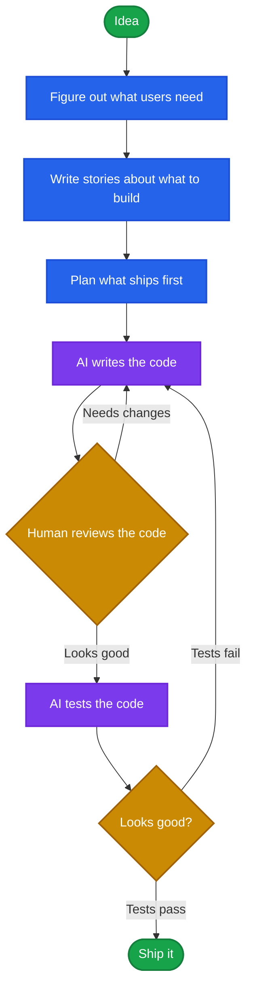

# Story-Driven Delivery

A human + AI workflow that takes an idea from opportunity through user stories to shipped code. People figure out what to build; agents help at every step and handle the implementation.

## The Simple Version

A person has an idea. A team figures out what to build. A robot helps build it. A human checks the work. It ships.



## Full Pipeline

```mermaid
flowchart TD
    %% Context sidebar
    subgraph CONTEXT["Design Context"]
        direction TB
        CTX_CANON["Domain Knowledge<br/>Users, roles,<br/>environment, relationships"]
        CTX_SOP["Standard Procedures<br/>Operational workflows,<br/>roles, business rules"]
        CTX_CONST["Design Methodology<br/>How we write stories,<br/>quality standards"]
        CTX_FEAT["Existing Design Work<br/>Active explorations,<br/>prior decisions"]
    end

    %% Main flow
    START(["New Idea"])

    OPP["1. Opportunity<br/>Product Owner + Agent brainstorm<br/>the problem worth solving"]

    OPP_DECIDE{"Opportunity<br/>Approved?"}

    ACT["2. User Activities<br/>Human + Agent map what<br/>users actually do, step by step"]

    ACT_DECIDE{"Activities<br/>Approved?"}

    STORYMAP["3. User Stories<br/>Human + Agent break each activity<br/>into specific user stories,<br/>prioritized top to bottom"]

    SLICE["4. Plan Releases<br/>Human + Agent group stories<br/>into shippable releases:<br/>Release 1 = smallest useful increment"]

    SLICE_DECIDE{"Releases<br/>Approved?"}

    DECOMP["5. Decomposition<br/>Agent creates GitHub issues<br/>for current release<br/>with acceptance criteria"]

    ISSUES(["Implementation Backlog<br/>(GitHub Issues)"])

    DECOMP_DECIDE{"Issues<br/>Ready?"}

    LABEL_IMPL["6. Label: ready-for-implementation"]

    IMPL["7. Implementation Bot<br/>Agent writes code,<br/>opens PR"]

    CODE_REVIEW{"8. Code Review<br/>(Human)"}

    LABEL_VAL["9. Label: needs-validation"]

    VALIDATE["10. Validation Bot<br/>Tests + acceptance checks"]

    FINAL_REVIEW{"11. Finalize Review<br/>(Human)"}

    MERGE["12. Merge"]
    DONE(["13. Done"])

    NEXT_SLICE{"More releases<br/>planned?"}

    %% Main flow connections
    START --> OPP
    OPP --> OPP_DECIDE
    OPP_DECIDE -->|Yes| ACT
    OPP_DECIDE -->|Rework| OPP

    ACT --> ACT_DECIDE
    ACT_DECIDE -->|Yes| STORYMAP
    ACT_DECIDE -->|Rework| ACT

    STORYMAP --> SLICE
    SLICE --> SLICE_DECIDE
    SLICE_DECIDE -->|Yes| DECOMP
    SLICE_DECIDE -->|Rework| STORYMAP

    DECOMP --> ISSUES
    ISSUES --> DECOMP_DECIDE
    DECOMP_DECIDE -->|Yes| LABEL_IMPL
    DECOMP_DECIDE -->|Rework| DECOMP

    LABEL_IMPL --> IMPL
    IMPL -->|opens PR| CODE_REVIEW

    CODE_REVIEW -->|Approve| LABEL_VAL
    CODE_REVIEW -->|Request changes| IMPL

    LABEL_VAL --> VALIDATE
    VALIDATE -->|pass| FINAL_REVIEW
    VALIDATE -->|fail| IMPL

    FINAL_REVIEW -->|Approve| MERGE
    FINAL_REVIEW -->|Request changes| IMPL
    MERGE --> DONE

    DONE --> NEXT_SLICE
    NEXT_SLICE -->|"Yes — decompose<br/>next release"| DECOMP
    NEXT_SLICE -->|No| END(["Complete"])

    %% Context feeds into discovery steps
    CTX_CANON -.->|"domain<br/>knowledge"| OPP
    CTX_SOP -.->|"operational<br/>processes"| ACT
    CTX_CONST -.->|"story methodology<br/>+ fidelity"| STORYMAP
    CTX_FEAT -.->|"existing<br/>design work"| OPP

    %% Styles

    %% Context - subtle dark
    style CONTEXT fill:#0f172a,color:#94a3b8,stroke:#334155,stroke-width:1px
    style CTX_CANON fill:#1e293b,color:#94a3b8,stroke:#334155,stroke-width:1px
    style CTX_SOP fill:#1e293b,color:#94a3b8,stroke:#334155,stroke-width:1px
    style CTX_CONST fill:#1e293b,color:#94a3b8,stroke:#334155,stroke-width:1px
    style CTX_FEAT fill:#1e293b,color:#94a3b8,stroke:#334155,stroke-width:1px

    %% Blue - Human + Agent brainstorm
    style OPP fill:#2563eb,color:#fff,stroke:#1d4ed8,stroke-width:2px
    style ACT fill:#2563eb,color:#fff,stroke:#1d4ed8,stroke-width:2px
    style STORYMAP fill:#2563eb,color:#fff,stroke:#1d4ed8,stroke-width:2px
    style SLICE fill:#2563eb,color:#fff,stroke:#1d4ed8,stroke-width:2px

    %% Purple - Agent actions
    style DECOMP fill:#7c3aed,color:#fff,stroke:#6d28d9,stroke-width:2px
    style IMPL fill:#7c3aed,color:#fff,stroke:#6d28d9,stroke-width:2px
    style VALIDATE fill:#7c3aed,color:#fff,stroke:#6d28d9,stroke-width:2px

    %% Gold - Human decisions
    style OPP_DECIDE fill:#ca8a04,color:#fff,stroke:#a16207,stroke-width:2px
    style ACT_DECIDE fill:#ca8a04,color:#fff,stroke:#a16207,stroke-width:2px
    style SLICE_DECIDE fill:#ca8a04,color:#fff,stroke:#a16207,stroke-width:2px
    style DECOMP_DECIDE fill:#ca8a04,color:#fff,stroke:#a16207,stroke-width:2px
    style CODE_REVIEW fill:#ca8a04,color:#fff,stroke:#a16207,stroke-width:2px
    style FINAL_REVIEW fill:#ca8a04,color:#fff,stroke:#a16207,stroke-width:2px
    style NEXT_SLICE fill:#ca8a04,color:#fff,stroke:#a16207,stroke-width:2px

    %% Green - Start/End states
    style START fill:#16a34a,color:#fff,stroke:#15803d,stroke-width:2px
    style ISSUES fill:#16a34a,color:#fff,stroke:#15803d,stroke-width:2px
    style DONE fill:#16a34a,color:#fff,stroke:#15803d,stroke-width:2px
    style END fill:#16a34a,color:#fff,stroke:#15803d,stroke-width:2px

    %% Labels - dark with gold border
    style LABEL_IMPL fill:#1e293b,color:#fbbf24,stroke:#ca8a04,stroke-width:2px
    style LABEL_VAL fill:#1e293b,color:#fbbf24,stroke:#ca8a04,stroke-width:2px

    %% Merge
    style MERGE fill:#1e293b,color:#e2e8f0,stroke:#475569,stroke-width:2px
```



## How It Works

### Discover (Steps 1-4): Human + Agent figure out what to build

**1. Opportunity** — A product owner has a problem. They sit down with the AI agent and explore it together. The agent asks probing questions, surfaces related problems from existing design work, and drafts an opportunity statement. The human decides if it's worth pursuing.

**2. User Activities** — Map out what users actually do, step by step. Not features — real activities in their real workflow. "Marci reviews the renewal queue." "Lindsay schedules a tour." The agent proposes activities grounded in known operational procedures. The human validates the sequence.

**3. User Stories** — Break each activity into specific stories. Under "Marci reviews the renewal queue" you might have: "Marci sees which renewals need attention today," "Marci sends a renewal offer to a resident," "Marci escalates a stalled renewal to her regional manager." Prioritize top to bottom — most essential first. The agent generates story candidates; the human curates.

**4. Plan Releases** — Group stories into releases. Release 1 is the smallest thing that works end-to-end. Release 2 adds depth. Release 3 adds more. The agent proposes groupings based on dependencies — "these three stories need each other to be useful." The human decides where to draw the lines.

### Build (Steps 5-7): Agent implements, human triggers

**5. Decomposition** — The agent takes the current release and creates GitHub issues with acceptance criteria for each story.

**6. Label: `ready-for-implementation`** — Human reviews the issues and applies the label when one is fully spec'd and ready for AI pickup.

**7. Implementation Bot** — Agent claims the issue, writes code on a feature branch, and opens a PR linked to the issue.

### Ship (Steps 8-13): Human reviews, agent validates

**8. Code Review** — Human reviews the AI-generated code. Approves or requests changes.

**9. Label: `needs-validation`** — Human applies the label to trigger automated QA.

**10. Validation Bot** — Runs tests, linting, and acceptance checks. Posts results to the PR.

**11. Finalize Review** — Human reviews validation results and approves.

**12. Merge** — Human merges to main.

**13. Done** — Issue closed. If more releases are planned, loop back to step 5 and decompose the next one.

## Who Does What

| Step | People | AI |
|------|--------|----|
| **Idea** | Someone has a problem to solve | -- |
| **Figure out what users need** | Describes what real people do day to day | Helps ask good questions |
| **Write stories** | Decides what matters most | Helps write the stories |
| **Plan what ships first** | Picks what to build first | Suggests what goes together |
| **Write the code** | -- | Writes the code |
| **Review the code** | Reads the code, checks for mistakes | -- |
| **Test the code** | -- | Runs tests to make sure it works |
| **Looks good?** | Final thumbs up or thumbs down | -- |
| **Ship it** | Done! | -- |

## How Each Role's Context Feeds In

Context doesn't add steps — it's what makes the agents useful instead of generic. Each role contributes context that the agents consume at the right moment.

### Product Owner

The product owner brings the **why** and the **what** — business goals, customer problems, domain knowledge, and prioritization decisions.

| Where it feeds in | What it provides |
|-------------------|-----------------|
| **1. Opportunity** | The problem statement, business case, and success criteria. The agent reads domain knowledge (users, roles, environment) and existing design work so it can brainstorm within the real problem space, but the product owner decides what's worth pursuing. |
| **2. User Activities** | Validation that the activity sequence reflects real user workflows. The agent proposes activities from standard operating procedures, but the product owner confirms "yes, this is how our users actually work." |
| **3. User Stories** | Priority decisions — which stories are essential, which are nice-to-have. The agent generates candidates grounded in real user profiles and the team's design methodology; the product owner curates and ranks them. |
| **4. Plan Releases** | The final call on release boundaries. The agent proposes groupings based on dependencies; the product owner decides what ships when based on business value and customer need. |

### Engineering

Engineering context defines the **how** — architecture, technical constraints, coding standards, and system boundaries. This is what makes the implementation and validation agents produce real code instead of toy examples.

| Where it feeds in | What it provides |
|-------------------|-----------------|
| **5. Decomposition** | Technical constraints shape how stories become issues. The agent needs to know the tech stack, API boundaries, data models, and existing code structure to write issues with realistic acceptance criteria. Engineering context comes from the repo itself — code, tests, configs, and architecture docs. |
| **6. `ready-for-implementation`** | Engineers (or the product owner with engineering input) validate that the issue is technically feasible as spec'd before labeling it for AI pickup. |
| **7. Implementation Bot** | The agent reads the codebase — existing patterns, frameworks, conventions, dependencies — to write code that fits. Engineering context *is* the repo: the agent follows what's already there. |
| **8. Code Review** | A human engineer reviews the AI-generated code for correctness, security, architecture fit, and adherence to team standards. This is the primary engineering gate. |

### QA

QA context defines **how we know it works** — test strategies, acceptance criteria, edge cases, and quality standards.

| Where it feeds in | What it provides |
|-------------------|-----------------|
| **3. User Stories** | QA thinking influences story writing. Well-written acceptance criteria on each story ("given X, when Y, then Z") come from understanding what needs to be tested. The agent drafts criteria; QA validates they're complete. |
| **5. Decomposition** | Each GitHub issue inherits acceptance criteria from its parent story. QA reviews these to ensure edge cases and error states are covered before implementation begins. |
| **10. Validation Bot** | The agent runs the test suite, linting, and acceptance checks defined by the QA strategy. QA context lives in the test infrastructure — test files, CI config, coverage thresholds, and any acceptance test definitions linked to the stories. |
| **11. Finalize Review** | A human reviews validation results. If tests pass but the QA reviewer spots a gap (untested edge case, missing integration test), they request changes before approval. |

### Design

Design brings the **who** and the **experience** — real users, real scenarios, narrative grounding, and the designed interaction from trigger to goal.

| Where it feeds in | What it provides |
|-------------------|-----------------|
| **1. Opportunity** | Domain knowledge (users, roles, environment) and existing design work ensure opportunities are grounded in real user scenarios, not abstract market assumptions. |
| **2. User Activities** | Standard operating procedures and role definitions provide the real workflows that activities map to. Design ensures activities describe human experience, not just system functions. |
| **3. User Stories** | This is design's center of gravity. The team's design methodology and real user profiles ensure stories have named people, triggering events, emotional stakes, and goals — not generic feature descriptions. |
| **4. Plan Releases** | Existing design work and prior explorations ground release planning in what the team has already learned. Design ensures Release 1 tells a coherent story end-to-end, not a grab bag of unrelated features. |
| **8. Code Review** | Design validates that the implementation matches the designed experience — does the code deliver what the story described? |
| **11. Finalize Review** | Design confirms the shipped experience matches intent before merge. |

### How They Overlap

```
Steps:  1───2───3───4───5───6───7───8───9───10───11───12───13

PO:     ████████████████░░░░░░░░░░░░░░░░░░░░░░░░░░░░░░░░░░░░
        Opportunity → Activities → Stories → Releases

DESIGN: ████████████████████░░░░░░░░████░░░░░░░░░░██░░░░░░░░░
        Opportunity → Activities → Stories → Releases  Review  Final

ENG:    ░░░░░░░░░░░░░░░░████████████████████████░░░░░░░░░░░░░
                         Decomposition → Implement → Code Review

QA:     ░░░░░░░░░░██░░░░██░░░░░░░░░░░░░░░░░░░░░░████████░░░░
                Stories  Decomp                  Validate → Review
```

Product Owner decides **what** to build. Design defines **who** it's for and **what the experience is**. Engineering figures out **how** to build it. QA confirms **it works**. PO and Design overlap heavily in discovery (steps 1-4) — the product owner brings business value, the designer brings human experience, and together they shape the stories that drive everything downstream.

## Workflows Used

| Workflow | Trigger | Role |
|----------|---------|------|
| [story-decomposition](../../workflows/story-decomposition.md) | Issue labeled `ready-for-decomposition` | Decomposes a story into implementation sub-issues |
| Implementation *(project-specific)* | Issue labeled `ready-for-implementation` | Reads the issue and writes code |
| [validation](../../workflows/validation.md) | PR labeled `needs-validation` | Validates implementation against acceptance criteria |

## Setup

### 1. Decomposition Workflow

```bash
gh aw add-wizard RealPage/agentics/workflows/story-decomposition.md@v0.2.0
```

### 2. Implementation Workflow

The implementation workflow is **project-specific** — it references your codebase paths, test commands, and tech stack. It is not included in this shared library.

Use the [agentic-workflow-template](https://github.com/RealPage/agentic-workflow-template) as a starting point, then customize for your project.

### 3. Validation Workflow

```bash
gh aw add-wizard RealPage/agentics/workflows/validation.md@v0.2.0
```

## Prerequisites

| File | Used By | Purpose |
|------|---------|---------|
| `CLAUDE.md` | All workflows | Project context, tech stack, and conventions |
| `.github/workflows/implementation.md` | Implementation | Project-specific agent instructions |

## Legend

| Shape | Color | Meaning |
|-------|-------|---------|
| Rounded rectangle | **Blue** | Human + Agent working together |
| Rectangle | **Purple** | Agent working autonomously |
| Diamond | **Gold** | Human decision point |
| Stadium | **Green** | Start / End / Milestone |
| Dark + gold text | **Dark** | Label that triggers automation |
| Dashed lines | **Gray** | Repo context feeding into a step |
